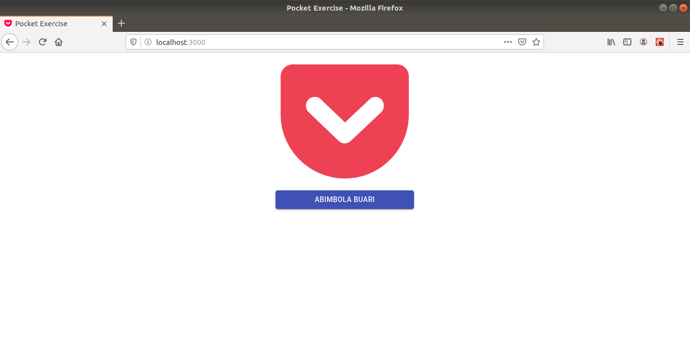

# Pocket Exercise

This project create a component that renders Pocket's logo centered at the top of the screen using React.js,CSS and integrated Material UI button that contains my name below the Pocket logo.

### Resource used

[Pocket Press Kit](https://blog.getpocket.com/press/)

